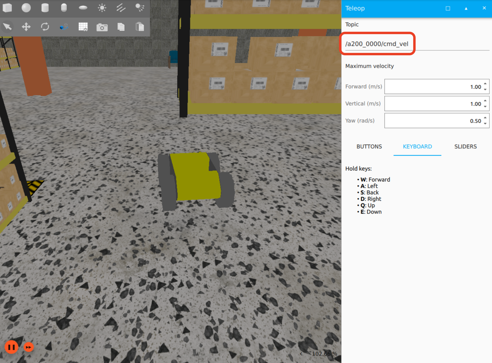

# ROS-Robot-Exploration

This project aims to build robotic systems using ROS2 and physics simulators such as Gazebo. So far, the Husarion ROSbot has been used for autonomous exploration and mapping. Next, a similar system build is achieved with a Clearpath Robotics robot (`a200_0000`). The project is still in progress and will be updated as new features are added.

Readers are welcome to jump straight to the [Robot Exploration](#5-exploration) section for the Husarion ROSbot robot exporation work, or to [Clearpath Robotics](#7-clearpath-robotics) to control the `a200_0000` Clearpath robot. 




## Getting Started
### Using Host Machine (stable)
To run this project on your host machine, you will need to have **ROS2 humble** installed on a **Ubuntu 22.04** system. If you do not have ROS2 installed, you can follow the instructions on the [ROS2 humble website](https://docs.ros.org/en/humble/Installation/Ubuntu-Install-Debians.html).

Once you have ROS2 installed, you can clone this repository and build the project using the following commands:

1. Clone the repository:

    ```bash
    git clone https://github.com/OliverHeilmann/ROS-Robot-Exploration --recurse-submodules
    cd ROS-Robot-Exploration
    ```

2. Install the necessary dependencies and build the project:

    ```bash
    chmod +x entrypoint.sh
    ./entrypoint.sh
    ```

3. Launch Gazebo (alias was created at above step):

    ```bash
    ROSBOT_SIM
    ```

4. Launch the Exploration ROSbot code (new terminal):

    ```bash
    ros2 launch rosbot explore.launch.py use_gazebo:=true
    ```


### Using Docker (experimental)
Here, we are using Docker to make the setup process easier. The Docker container will have ROS2 installed and the ROSbot simulation running. Additionally, all the GUI tools will be forwarded to the host machine so you can run this project on any machine that supports Docker! There are a few things to setup if you are using a Mac or Windows machine first however (see below).

### Linux
Nothing to do here! Just ensure you have Docker installed on your machine.

### MacOS
To forward X11 from inside a docker container to a host running macOS

1. Install XQuartz: https://www.xquartz.org/
2. Launch XQuartz.  Under the XQuartz menu, select Preferences
3. Go to the security tab and ensure "Allow connections from network clients" is checked.
4. Restart XQuartz and Docker Desktop (if running). If you experience any issues, restart your computer as well or follow this [Gist](https://gist.github.com/cschiewek/246a244ba23da8b9f0e7b11a68bf3285) guide.

### Windows
WIP! Need to check if X11 forwarding works on Windows. If not, will need to use VcXsrv or similar.

### Building and Running the Project
1. Clone the repository:

    ```bash
    git clone https://github.com/OliverHeilmann/ROS-Robot-Exploration --recurse-submodules
    cd ROS-Robot-Exploration
    ```

2. Build the Docker container using the provided Dockerfile. *Note: This step will take around 20 minutes to build dependencies and the project*:

    ```bash
    chmod +x run.sh
    ./run.sh
    ```

3. Launch Gazebo in a new terminal (Note: works on Ubuntu 22.04, some isses with X11 forwarding Ubuntu 20.04):

    ```bash
    docker exec -it ros_robot_exploration /bin/bash

    # Then inside the container
    ROSBOT_SIM

    # Alternatively, launch headless (may work on Ubuntu 20.04 depending on your setup)
    ros2 launch rosbot_xl_gazebo simulation.launch.py headless:=True
    ```

4. Launch the Exploration ROSbot code (new terminal):

    ```bash
    docker exec -it ros_robot_exploration /bin/bash

    # Then inside the container
    ros2 launch rosbot explore.launch.py use_gazebo:=true
    ```

<!-- 4. Drive the robot around using your keyboard. Run the teleop_twist_keyboard executable as shown below:
    
    ```bash
    ros2 run teleop_twist_keyboard teleop_twist_keyboard
    ``` -->

That's it! You should now have a Gazebo simulation running with the ROSbot exploring the environment.

*Note: If you are experiencing issues stopping the docker container, try using the command below (taken from [Stack Overflow issue](https://stackoverflow.com/questions/47223280/docker-containers-can-not-be-stopped-or-removed-permission-denied-error)):*

```bash
 sudo aa-remove-unknown
```

# Running the Project(s)
Readers are welcome to jump straight to the [Robot Exploration](#5-exploration) section for the Husarion ROSbot robot exporation work, or to [Clearpath Robotics](#7-clearpath-robotics) to control the `a200_0000` Clearpath robot. Several "stepping stone" projects have been included below first, as they were useful in developing my knoweldge of ROS during the development process. Feel free to read through them and try the examples out for yourselves!

## 1) Transformations
Running static transforms through through the terminal can useful for understanding the tf2 library. Below is an example of how to run static transforms between the map, robot, and camera frames and visualize them in RViz. See below for the transformation arguments:

- `--x` - x component of translation
- `--y` - y component of translation
- `--z` - z component of translation
- `--qx` - x component of quaternion rotation
- `--qy` - y component of quaternion rotation
- `--qz` - z component of quaternion rotation
- `--qw` - w component of quaternion rotation
- `--roll` - roll component Euler rotation
- `--pitch` - pitch component Euler rotation
- `--yaw` - yaw component Euler rotation

In separate terminals, run the following commands to create static transformations between the map, robot, and camera frames and visualise them in RViz:

```sh
# Create static transformations between the map and robot frames
ros2 run tf2_ros static_transform_publisher --frame-id map --child-frame-id robot --x 1 --y -1 --yaw 1.6

# Create static transformations between the robot and camera frames
ros2 run tf2_ros static_transform_publisher --frame-id robot --child-frame-id reverse_camera --z 0.2 --yaw 3.14 

# Visualize the transformations in RViz
rviz2 -d src/rosbot/rviz/tf.rviz 
```

Alternatively, you can create a launch file to run all the commands at once. Below is an example of the contents of this launch file:
```xml
<launch>
    <node pkg="tf2_ros" type="static_transform_publisher" name="map_to_robot" args="--frame-id map --child-frame-id robot --x 1 --y -1 --yaw 1.6" />
    <node pkg="tf2_ros" type="static_transform_publisher" name="robot_to_camera" args="--frame-id robot --child-frame-id reverse_camera --z 0.2 --yaw 3.14" />
</launch>
```

Another example shows how a transformation can occur over time, where the robot moves in a circle about the map centre coordinates. Use the launch file as shown below to observe this:
```sh
ros2 launch rosbot tf_broadcaster.yaml
```


## 2) OpenCV and Object Tracking
This project demonstrates how to use OpenCV to track objects in a video stream. The `cv_bridge` package is used to convert ROS messages to OpenCV images and vice versa. Specifically, the `cv_bridge` package is used to convert the image from `cv::Mat` to `sensor_msgs::msg::Image` and vice versa. The KCF tracker from the OpenCV library is then used to determine the new position of the object.

See the [tracker.cpp](src/rosbot/src/tracker.cpp) and [tracker.hpp](src/rosbot/include/rosbot/tracker.hpp) files for the implementation of the tracker. To run the tracker, use the following command:

```sh
# Terminal 1: Launch the tracker node
ros2 launch rosbot tracker.yaml

# Terminal 2: Launch the Gazebo simulation
ROSBOT_SIM

# Terminal 3: RVIZ to visualise the tracking
rviz2 -d src/rosbot/rviz/rosbot.rviz 
```

*Note: The above separate commands can be combined into a single launch file... have done this in later sections.*


## 3) SLAM and AMCL (Adaptive Monte-Carlo Localisation)
To perform SLAM, you can use the `slam_toolbox` package. This package provides a set of tools for 2D and 3D SLAM. The package has been installed as part of the `dependencies.sh` script.

To run the SLAM toolbox work, use the following command:

```sh
# Terminal 1: Launch Gazebo simulator
ROSBOT_SIM

# Terminal 2: Launch the slam toolbox node and RVIZ
ros2 launch rosbot slam.launch.py use_sim_time:=true
```


To use `Adaptive Monte Carlo Location` with ROS2, we can use the `amcl` package. This package provides a probabilistic localisation system for a robot moving in 2D. This repository comes with a map.yaml and map.pgm file for the map of the environment (which is required for AMCL). Test this out using the following commands:

```sh
# Terminal 1: Launch Gazebo simulator
ROSBOT_SIM

# Terminal 2: To launch the AMCL package
ros2 launch rosbot amcl.launch.py
```

Loading saved maps and using them in the navigation stack can be done using the following commands:

```sh
# Terminal 3: To load a saved map, navigate to the map directory and run the below command
ros2 run nav2_map_server map_server --ros-args -p yaml_filename:=<your-map-name>.yaml

# Terminal 4: Then run the map server to load it into RVIZ
ros2 run nav2_util lifecycle_bringup map_server
```


## 4) Navigation
To perform navigation, you can use the `nav2` package. This package provides a set of tools for 2D and 3D navigation. The package has been installed as part of the `dependencies.sh` script.

Launch the navigation stack using the following command:

```sh
# To launch the navigation stack
ros2 launch rosbot navigation.launch.py
```

More detail (and links to even further detail) can be found on [Husarion Docs](https://husarion.com/tutorials/ros2-tutorials/9-navigation/) but, for my own reference, below are some high level comments on navigation2 principles:

- Three main aspects of navigation when implemented:
    - `Costmap`: environment representation of the *effort* or *cost* to move through space.
    - `Planner`: the algorithm that determines the path to the goal (**graph** or **occupancy grid** methods, think of A* etc.).
    - `Controller`: the algorithm that determines how to move the robot along the path e.g. PID controllers or Regulated Pure Pursuit.

- Some specific functionalities for `nav2`:
    - `planner_server` - related to the selection and fine-tuning of the global path,
    - `controller_server` - reates a local costmap and implements the server for handling the controller requests. Consider how the controller is responsible for taking actions which will move the robot to the goal, but ensuring that the robot avoids obstacles and stays on the intended path. An example is `Regulated Pure Pursuit` which adjusts "steering" based on a look ahead distance to the intended path (some similarities to PID controllers for smoothing robot motion).
    - `behavior_server` - to configure recovery behavior, for instance when the robot is stuck.
    - `bt_navigator` - allows you to change the behavior of services to create a unique robot behavior (default behavior tree will be used).
    - `Smoother Server` - creates smoother path plans to be more continuous and feasible. This may be useful for robots with non-holonomic constraints e.g. ackermann steering. Consider inflating the costmap to account for the robot's footprint and turning radius.

- Some specific parameters for `nav2` configuration:
    - `amcl` - used for localisation of the robot. It uses a particle filter to estimate the robot's position on a *known* map.
    - `local_costmap/global_costmap` - The costmap is created based on the provided map and data from sensors such as cameras and laser scanners that measure whether there are obstacles in the way. Then it creates a special map where each spot has a "cost" value. `local_costmap` is used for local planning and `global_costmap` is used for global planning, where local planning is used to avoid obstacles and global planning is used to find the shortest path to the goal.
    - `waypoint_follower` - related to following a multi-point route,
    - `velocity_smoother` - to smooth out the robot's motion.


## 5) Exploration
To perform exploration, you can use the `explore_lite` package. This package provides a lightweight exploration algorithm for a robot moving in 2D. The package has been installed as part of the `dependencies.sh` script.

*"The node relies on the occupancy map generated by slam_toolbox, on the basis of which it selects a point to discover an unexplored area. After reaching the selected point, the map algorithm is expanded and the robot heads to the next point. This process is repeated until all boundaries have been explored."* [Husarion Docs](https://husarion.com/tutorials/ros2-tutorials/10-exploration/#introduction)

```sh
# Terminal 1: Launch Gazebo simulator
ROSBOT_SIM

# Terminal 2: To launch the exploration node and RVIZ
ros2 launch rosbot explore.launch.py use_gazebo:=true
```


## 6) Joystick Robot Control
Use a joystick to control the robot. The `joy` package provides a node that interfaces with a joystick and publishes the joystick commands to the `/joy` topic. To use the package, run the following commands:

```sh
# See if you have a connected controller visible by the system
evtest

# See which controllers are connected, and which ID you want to use
ros2 run joy joy_enumerate_devices

# Run the joy node to publish joystick commands to the /joy topic
ros2 run joy joy_node

# To see the joystick commands, run the following command
ros2 topic echo /joy

# When you have the joystick commands, you can use the teleop_twist_joy package to control the robot. Use the Left Trigger and Left Stick to control the robot's linear and angular velocities.
ros2 launch rosbot joystick.launch.py
```


## 7) Clearpath Robotics
To use the Clearpath Robotics simulation environment within this workspace, you will have to  add a `robot.yaml` file to the `modules/clearpath/` directory, which can be found in the [Clearpath Documentation](https://docs.clearpathrobotics.com/docs/ros/config/yaml/overview#sample) for example.

Clearpath require a `robot.yaml` file which is used to configure the robot. This file is used to define the robot's kinematics, sensors, and other parameters. Create a `robot.yaml` file in the `modules/clearpath/` directory with the following content (noting your workspace path may be different):

```yaml
serial_number: a200-0000
version: 0
system:
  username: administrator
  hosts:
    - hostname: cpr-a200-0000
      ip: 192.168.131.1
  ros2:
    namespace: a200_0000
    domain_id: 0
    middleware:
      implementation: rmw_fastrtps_cpp
    workspaces:
      - "/home/parallels/ROS-Robot-Exploration/install/setup.bash"
platform:
  controller: ps4
  battery:
    model: ES20_12C
    configuration: S2P1
```

Now launch the simulation using the following command:

```sh
# Make sure to add the path to your clearpath directory - this repo has it in the following location
ros2 launch clearpath_gz simulation.launch.py setup_path:=$HOME/ROS-Robot-Exploration/modules/clearpath/

# Change the world to your desired world, example below:
ros2 launch clearpath_gz simulation.launch.py world:=my_world
```

Make sure to add the correct namespace before teleoperating the rover, as shown below:


Using the WASD keys, you should be able to drive the robot around the environment.


<!--
### Useful Commands
```sh
# clone a repository as a submodule (ensure it is not gitignored)
git submodule add [the-repository-to-clone]  [the-directory-to-clone-into]

# To update the submodules
git submodule update --init --recursive --remote

ln -s ../modules modules

```

```sh
# To list all the nodes
ros2 node list
ros2 node info [the-node]

# To list all the topics
ros2 topic list
ros2 topic info [the-node]
ros2 topic echo [the-topic]

# To visualize the ROS graph
rqt_graph

# Created alias for launching the Gazebo simulation
ROSBOT_SIM

# To launch the simulation
rviz2 -d ~/[path-to-rviz-file]/rosbot.rviz

# To inspect logged information with a UI
ros2 run plotjuggler plotjuggler

# To build a specific package
colcon build --packages-select [the-package]

# To source the ROS workspace after building new packages
source ~/ROS-Robot-Exploration/install/setup.bash

# Install a ROS package
sudo apt-get install ros-$ROS_DISTRO-[the-package-name]

# Create a ROS package
ros2 pkg create [package-name] --build-type ament_cmake --dependencies [the-dependencies]

# List your packages
colcon list

# Call empty service (in this case to save the map)
ros2 service call /save std_srvs/srv/Empty {}
ros2 service call /image_counter std_srvs/srv/Trigger {}

# Get specific field information from an echo terminal command
ros2 topic echo /odometry/filtered --field pose.pose
```


### Networking with ROS2

ROS will work over LAN so, if you have two devices on the same network, you will be able to publish and subscribe to the same topics i.e. they are visible to one another. See example below:
```sh
# ROSbot: Create a /msg topic and send send at rate=1s
ros2 topic pub -r 1 /msg std_msgs/msg/String data:\ 'Hello, ROSbot here'

# Laptop: Echo the /msg topic
ros2 topic echo /msg
```

Using `ROS_DISCOVERY_SERVER` segregates 'robot networks' within the same LAN. Instead of depending on the standard multicast-based LAN discovery, which is the default for DDS, you have the option to transition to the Discovery Server approach for DDS discovery.
     
```sh
# ROSbot: Start the Discovery Server
fastdds discovery --server-id 0 --port 11888

export ROS_DISCOVERY_SERVER="10.5.10.130:11888"
ros2 daemon stop # reload ROS 2 daemon

ros2 run demo_nodes_cpp talker
```

```sh
# Laptop: Start the Discovery Server
export ROS_DISCOVERY_SERVER="10.5.10.130:11888"
ros2 daemon stop # reload ROS 2 daemon

ros2 run demo_nodes_cpp listener
```

If you want to access ROS2 nodes over the internet, [Husarian](https://husarion.com/tutorials/ros2-tutorials/6-robot-network/#connecting-ros-2-via-internet) provides a tutorial on how to do this using their cloud service. It is essentially a VPN service that allows you to connect to your robot from anywhere in the world.

Some interesting suggestions for security across the ROS2 network are mentioned in this [LinkedIn](https://www.linkedin.com/advice/0/how-can-you-secure-your-ros-system-from-cyber-threats-hgw0c) article. including [rosauth](https://wiki.ros.org/rosauth), [sros](https://docs.ros.org/en/rolling/Tutorials/Advanced/Security/Introducing-ros2-security.html), or [rosbridge_suite](https://github.com/RobotWebTools/rosbridge_suite/blob/ros2/README.md).
-->

## License
This project is licensed under the [MIT License](LICENSE).