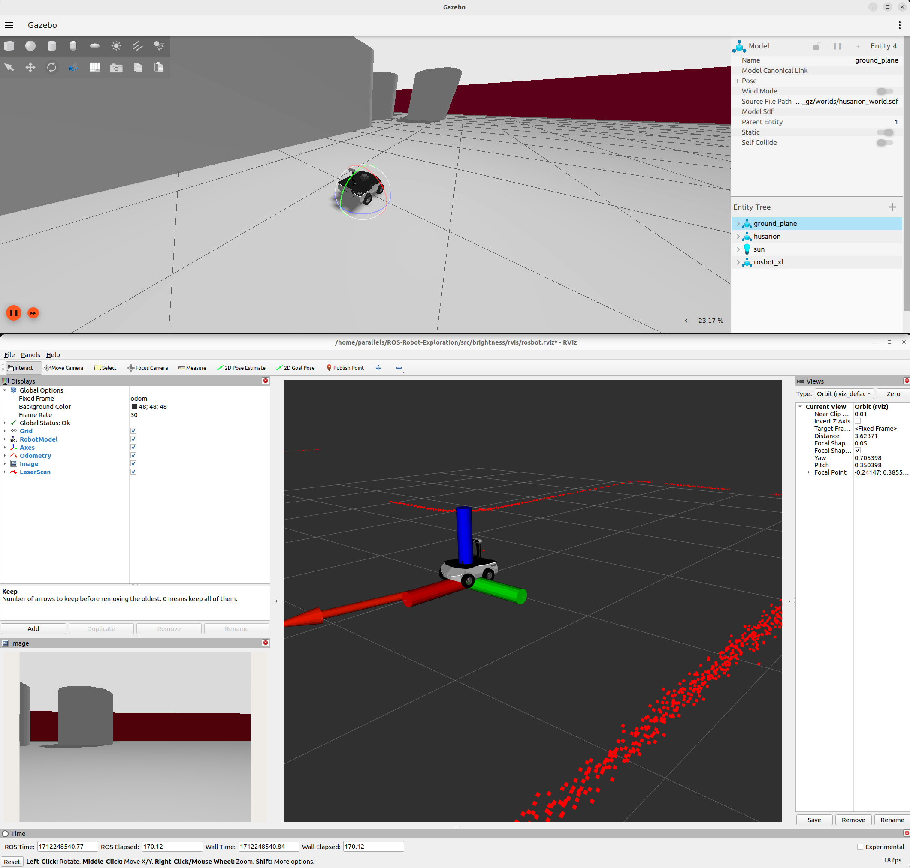

# ROS-Robot-Exploration

This project aims to build a robotic system using ROS2 and Husarion ROSbot for autonomous exploration and key item detection in an area.

## Progress So Far


<!--  -->

## Requirements

- ROS2: Make sure you have ROS2 installed on your system. You can follow the installation instructions from the official ROS2 documentation: [ROS2 Humble Installation Guide](https://docs.ros.org/en/humble/Installation/Ubuntu-Install-Debians.html)

- Husarion ROSbot: You do **NOT** need a Husarion ROSbot for this project. If you wish to purchase one however, you can find more information from the official Husarion ROSbot website: [Husarion ROSbot](https://husarion.com/tutorials/)

## Dependencies

- Python: The project uses Python for programming. Make sure you have Python installed on your system. You can download Python from the official Python website: [Python Downloads](https://www.python.org/downloads/)

- C++: The project also uses C++ for programming. Make sure you have a C++ compiler installed on your system. You can install the GNU C++ compiler by running the following command:

    ```bash
    sudo apt-get install g++
    ```

- ROS2 Packages: Install the necessary ROS2 packages by running the following command:

    ```bash
    sudo apt-get install ros-<distro>-<package-name>
    ```

    Replace `<distro>` with the ROS2 distribution you are using (e.g., foxy, galactic) and `<package-name>` with the name of the required ROS2 package.

## Getting Started

1. Clone the repository:

    ```bash
    git clone https://github.com/OliverHeilmann/ROS-Robot-Exploration
    ```

2. Build the project:

    ```bash
    cd ROS-Robot-Exploration
    colcon build
    ```

3. Launch the exploration and detection nodes:

    ```bash
    source install/setup.bash
    ros2 launch exploration_detection.launch.py
    ```

4. Drive the robot around using your keyboard. Run the teleop_twist_keyboard executable as shown below:
    
    ```bash
    ros2 run teleop_twist_keyboard teleop_twist_keyboard
    ```

## Useful Commands

```sh
# To list all the nodes
ros2 node list
ros2 node info [the-node]

# To list all the topics
ros2 topic list
ros2 topic info [the-node]
ros2 topic echo [the-topic]

# To visualize the ROS graph
rqt_graph

# Created alias for launching the Gazebo simulation
ROSBOT_SIM

# To launch the simulation
rviz2 -d ~/[path-to-rviz-file]/rosbot.rviz

# To inspect logged information with a UI
ros2 run plotjuggler plotjuggler

# To build a specific package
colcon build --packages-select [the-package]

# Install a ROS package
sudo apt-get install ros-$ROS_DISTRO-[the-package-name]

# Call empty service (in this case to save the map)
ros2 service call /save std_srvs/srv/Empty {}
ros2 service call /image_counter std_srvs/srv/Trigger {}

# Get specific field information from an echo terminal command
ros2 topic echo /odometry/filtered --field pose.pose
```

## Networking with ROS2

ROS will work over LAN so, if you have two devices on the same network, you will be able to publish and subscribe to the same topics i.e. they are visible to one another. See example below:
```sh
# ROSbot: Create a /msg topic and send send at rate=1s
ros2 topic pub -r 1 /msg std_msgs/msg/String data:\ 'Hello, ROSbot here'

# Laptop: Echo the /msg topic
ros2 topic echo /msg
```

Using `ROS_DISCOVERY_SERVER` segregates 'robot networks' within the same LAN. Instead of depending on the standard multicast-based LAN discovery, which is the default for DDS, you have the option to transition to the Discovery Server approach for DDS discovery.
     
```sh
# ROSbot: Start the Discovery Server
fastdds discovery --server-id 0 --port 11888

export ROS_DISCOVERY_SERVER="10.5.10.130:11888"
ros2 daemon stop # reload ROS 2 daemon

ros2 run demo_nodes_cpp talker
```

```sh
# Laptop: Start the Discovery Server
export ROS_DISCOVERY_SERVER="10.5.10.130:11888"
ros2 daemon stop # reload ROS 2 daemon

ros2 run demo_nodes_cpp listener
```

If you want to access ROS2 nodes over the internet, [Husarian](https://husarion.com/tutorials/ros2-tutorials/6-robot-network/#connecting-ros-2-via-internet) provides a tutorial on how to do this using their cloud service. It is essentially a VPN service that allows you to connect to your robot from anywhere in the world.

Some interesting suggestions for security across the ROS2 network are mentioned in this [LinkedIn](https://www.linkedin.com/advice/0/how-can-you-secure-your-ros-system-from-cyber-threats-hgw0c) article. including [rosauth](https://wiki.ros.org/rosauth), [sros](https://docs.ros.org/en/rolling/Tutorials/Advanced/Security/Introducing-ros2-security.html), or [rosbridge_suite](https://github.com/RobotWebTools/rosbridge_suite/blob/ros2/README.md).

## Transformations

In separate terminals, run the following commands to create static transformations between the map, robot, and camera frames and visualize them in RViz:
```sh
# Create static transformations between the map, robot, and camera frames
ros2 run tf2_ros static_transform_publisher --frame-id map --child-frame-id robot --x 1 --y -1 --yaw 1.6

# Create static transformations between the robot and camera frames
ros2 run tf2_ros static_transform_publisher --frame-id robot --child-frame-id reverse_camera --z 0.2 --yaw 3.14 

# Visualize the transformations in RViz
rviz2 -d src/rosbot/rviz/tf.rviz 
```

Alternatively, you can create a launch file to run all the commands at once. Below is an example of the contents of this launch file:
```xml
<launch>
    <node pkg="tf2_ros" type="static_transform_publisher" name="map_to_robot" args="--frame-id map --child-frame-id robot --x 1 --y -1 --yaw 1.6" />
    <node pkg="tf2_ros" type="static_transform_publisher" name="robot_to_camera" args="--frame-id robot --child-frame-id reverse_camera --z 0.2 --yaw 3.14" />
</launch>
```

Another example shows how a transformation can occur over time, where the robot moves in a circle about the map centre coordinates. Use the launch file as shown below to observe this:
```sh
ros2 launch rosbot tf_broadcaster.yaml
```

## SLAM
To perform SLAM, you can use the `slam_toolbox` package. This package provides a set of tools for 2D and 3D SLAM. To install the package, run the following command:

```sh
sudo apt-get install ros-<distro>-slam-toolbox
```

To run the SLAM toolbox, use the following command:

```sh
ros2 launch tutorial_pkg slam.launch.py use_sim_time:=true

# To visualize the map in RViz
rviz2 -d src/rosbot/rviz/slam.rviz
```

## License
This project is licensed under the [MIT License](LICENSE).